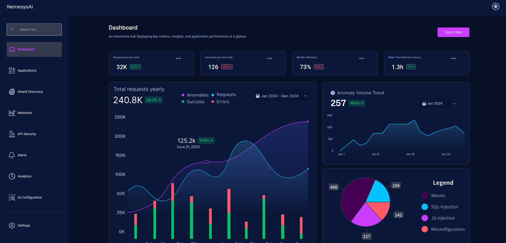
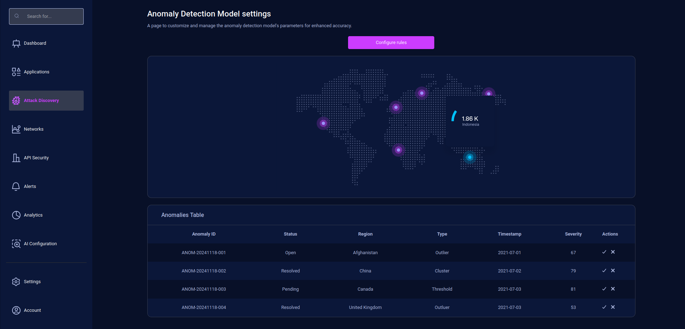
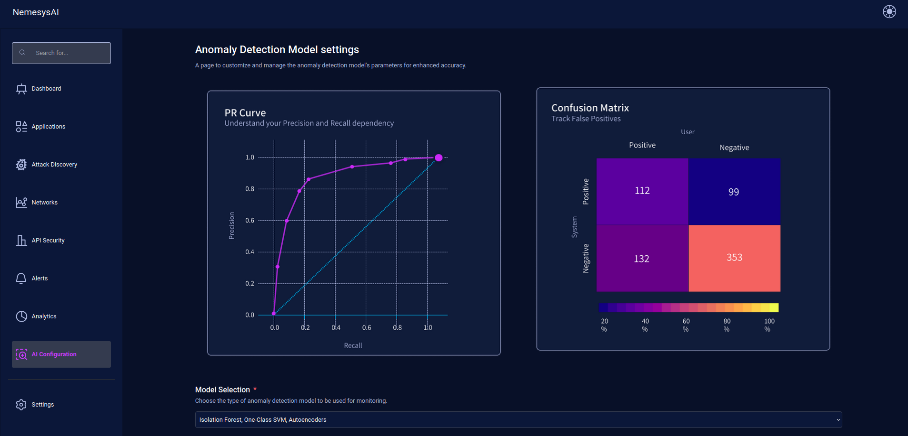
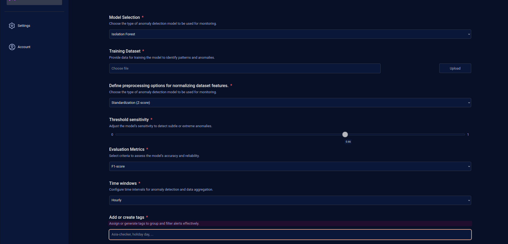

## 📊 Nemesys AI - Security as a Service

A **React-based** Security-as-a-Service application that provides **AI-powered anomaly detection insights**. It helps businesses monitor security events, detect threats, and analyze system reliability over time.

---

## 🚀 How to Run

| Step | Command                                                   | Description                        |
| ---- | --------------------------------------------------------- | ---------------------------------- |
| 1️⃣   | `git clone https://github.com/montare-lab/nemesys-ai.git` | Clone the repository.              |
| 2️⃣   | `cd nemesys-ai`                                           | Navigate to the project directory. |
| 3️⃣   | `npm start`                                               | Install                            |

## 🛡️ Key Features

- **📈 Anomaly Trends Over Time** – Visualizes detected security anomalies over time using real-time graphs and logs.
  

- **⏳ Uptime & Downtime Monitoring** – Tracks application availability and alerts when unexpected downtime occurs.
- **🤖 Model Efficiency Tracking** – Monitors how well the AI model detects threats over time and provides accuracy metrics.

- **🌍 Attack Geolocation Insights** – Maps security attacks to specific locations to identify high-risk regions.
  

- **📊 Model Evaluation Metrics** – Uses **Confusion Matrix**, **PR Curve**, and **ROC Curve** to assess model performance.
  

- **🚨 Custom Alert Rules** – Allows users to set security alert conditions and receive real-time notifications.
- **🔧 Model Configuration & Fine-Tuning** – Users can modify model parameters and update security settings to improve detection accuracy.
  
